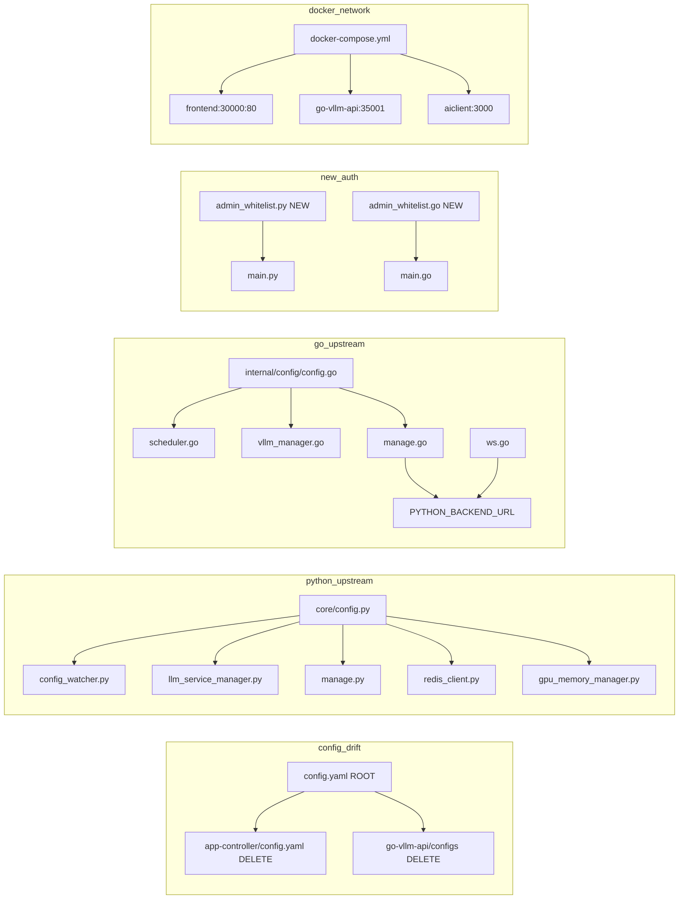

## 影响分析报告 - AIOS-ARCH-FIX

> 分析模式: tech-solution | 平台: multi-module | 风险等级: 🟡 MEDIUM

### 📊 变更概览
- 直接变更文件: 10 个
- 上游影响(调用方): 4 个
- 下游影响(依赖项): 2 个(config副本待删)
- 测试覆盖缺口: 4 个
- **风险等级: 🟡 MEDIUM**

---

### 🔗 调用链路图

---

### 📍 业务影响路径

| 变更文件 | 业务入口 | 置信度 |
|---------|---------|-------|
| config.yaml | B端管控→模型列表/引擎切换 | high |
| admin_whitelist.py | B端管控→所有/manage/*写操作 | high |
| nginx.conf | 前端面板→全页面路由 | high |
| docker-compose.yml | 全栈Docker部署 | high |
| vite.config.ts | 开发环境→全页面 | medium |
| backend-client.js | C端推理→aiclient插件 | medium |

---

### 🧪 测试覆盖缺口(4个)

| 文件 | 建议测试类型 | 优先级 |
|------|-----------|-------|
| admin_whitelist.py | unit(IP白名单) | P0 |
| config.py | unit(config加载) | P1 |
| admin_whitelist.go | unit(Go白名单) | P1 |
| config.go | unit(Go config加载) | P2 |

---

### 📋 回归测试建议

**自动化测试命令**:
- `cd app-controller && pytest tests/test_admin_whitelist.py`
- `cd app-controller && pytest tests/test_config_loading.py`
- `cd go-vllm-api && go test ./internal/middleware/`

**手动验证点**:
- [ ] P0: Docker全栈部署 → 所有服务可达
- [ ] P0: B端面板 → 模型切换/引擎启停正常
- [ ] P0: 外网IP → /manage/* POST返回403
- [ ] P1: 开发环境 → Vite proxy对齐35000/35001
- [ ] P1: C端推理 → aiclient→Go→vLLM正常
