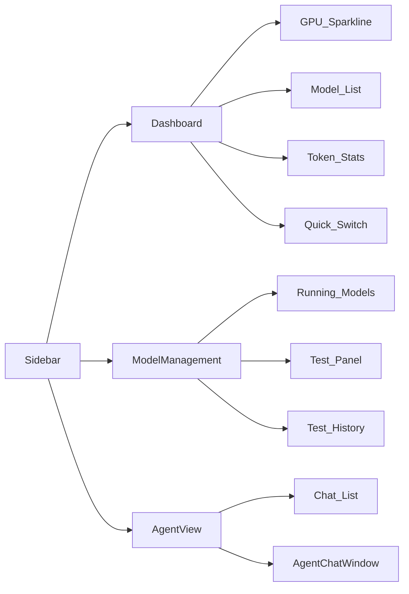

# 技术方案 — AIOS-FRONTEND-V3

> 前端菜单和页面优化重构

---

## 1. 背景&目标

当前前端侧边栏有 6 个导航项（仪表盘、实时监控、模型管理、聊天、Agent、文档），页面布局较分散。本次重构目标是：

1. **精简导航**：只保留 3 个核心入口（Dashboard、模型管理、Agent）
2. **优化 Dashboard**：整合 GPU 监控、模型列表、Token 用量、快捷切换四大模块
3. **优化模型管理**：完善检测结果展示和历史记录
4. **优化 Agent 界面**：改善流式对话体验

---

## 2. 范围&不做

**做**：侧边栏精简、Dashboard/ModelManagement/AgentView 视图优化
**不做**：后端 API 修改、ChatView/DocsView 独立页面删除（路由保留）

---

## 3. 核心设计思路

- **导航精简**：Sidebar navItems 从 6 项缩减到 3 项，路由保留 chat/docs 但不展示
- **Dashboard 重构**：2x2 卡片网格 → GPU 监控（左上，含 sparkline）、模型列表（右上，含一键操作）、Token 用量（左下）、快捷切换（右下）
- **模型管理优化**：左列运行模型（能力标签 badge）+ 右列检测区（功能矩阵/性能/资源/历史）
- **Agent 优化**：对话列表侧边栏 + AgentChatWindow 流式渲染优化

---

## 4. 方案流程图

---

## 5. 关键变更

### Sidebar.vue
- `navItems` 从 6 项 → 3 项：Dashboard/LayoutDashboard、模型管理/Server、Agent/Bot
- 移除 Activity/MessageSquare/BookOpen import
- 保留折叠和主题切换

### router/index.ts
- 移除 `monitor` 路由（合并到 Dashboard）
- 保留 chat/docs 路由但不侧边栏展示

### Dashboard.vue
- 重构为 4 卡片网格布局
- GPU 卡片：sparkline SVG 趋势图（温度/利用率/显存）
- 模型列表卡片：start/stop/switch 操作按钮
- Token 卡片：prompt/completion/total 统计
- 快捷切换卡片：运行模型 + default model 设置

### ModelManagement.vue
- 运行模型卡片增加：端口、请求数、能力标签（多模态/工具/图片生成）
- 检测结果优化：功能矩阵表格 + 性能指标 + 资源利用
- 历史记录：可展开详情

### AgentView.vue + AgentChatWindow.vue
- 优化对话列表布局
- 模型选择下拉样式优化
- 流式响应渲染优化
- 中断按钮交互优化

---

## 6. 风险与验证策略

| 风险 | 等级 | 处理 |
|------|------|------|
| Dashboard 重构影响自动刷新 | P2 | 复用现有 composables |
| 导航精简后页面可达性 | P2 | 路由保留，侧边栏隐藏 |

**验证**：`pnpm build` 无错误 + 手动验证各页面渲染

---

## 7. 待确认项

- 无（需求明确，现有代码覆盖所有 AC）
