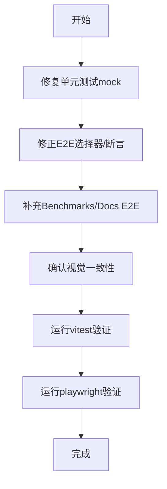

# AI OS Frontend V4 - 技术方案

## 背景 & 目标

Dashboard界面视觉体验需优化，E2E测试与实际UI不匹配导致无法通过，单元测试有3个失败需修复。

## 范围

**做**: 卡片样式统一、修复单元测试、修正E2E断言、补充Benchmarks/Docs E2E测试、响应式断点修正
**不做**: 新增功能、后端修改、性能优化

## 核心设计思路

### 1. 单元测试修复

**根因**: `useSystemData.test.ts` 的 mock 不匹配实际 composable 调用：
- mock了`getQueueStatus`但`useSystemData`不调用它（用`systemStatus.value?.queue`计算）
- 缺少`getSystemHistory`的mock（`useSystemData`内部调用`Promise.all([getSystemStatus, getHealthAlert, getSystemHistory])`）
- 缺少`systemStatus.queue`字段的mock数据

**方案**: 重新编写mock，与`useSystemData.ts`的实际调用对齐。

### 2. E2E测试修正

**问题清单**:
- `model-list-card`选择器不存在 → 实际类名是`running-card`
- `/chat`路由不存在 → 实际路由是`/agent`
- `.chat-view`不存在 → 实际类名是`agent-view`
- `.model-mgmt`可能在ModelManagement中不存在
- `.new-chat-btn`不存在 → 需检查AgentView实际类名
- 中屏断点1000px → 应为768px
- sidebar宽度220px → 实际240px
- 缺少Benchmarks和Docs页面测试

**方案**: 根据实际组件源码逐一修正选择器和断言。

### 3. 视觉一致性确认

**现状**: style.css已定义`card-base`(border-radius:16px, shadow)、`card-glow-*`系列、stagger动画。
Dashboard.vue使用`.card`类名 + 各自的glow类。

**方案**: 检查所有`.empty-state`样式是否统一（居中、灰色图标、14px文字），如有不一致则修正。

## 流程图

## AC → 文件映射

| AC编号 | AC描述 | ac_type | 对应文件路径 | 实现方式 |
|--------|--------|---------|-------------|---------|
| AC-01 | 骨架屏加载 | code | e2e/app.spec.ts | 新增E2E测试 |
| AC-02 | 卡片样式统一 | code | frontend/src/style.css | 确认现有样式 |
| AC-03 | 空状态样式 | code | frontend/src/views/Dashboard.vue | 修正空状态样式 |
| AC-04 | 单元测试通过 | code | composables/__tests__/useSystemData.test.ts | 修复mock |
| AC-05 | E2E测试通过 | code | e2e/app.spec.ts | 修正断言 |
| AC-06 | Benchmarks/Docs E2E | code | e2e/app.spec.ts | 新增测试 |
| AC-07 | 响应式布局 | code | e2e/app.spec.ts | 修正断点 |

## 风险与验证

- **P1**: E2E依赖后端服务 → 使用Playwright webServer配置
- **验证**: vitest run + playwright test 全部通过

## 回滚

git revert即可，低风险改动。
