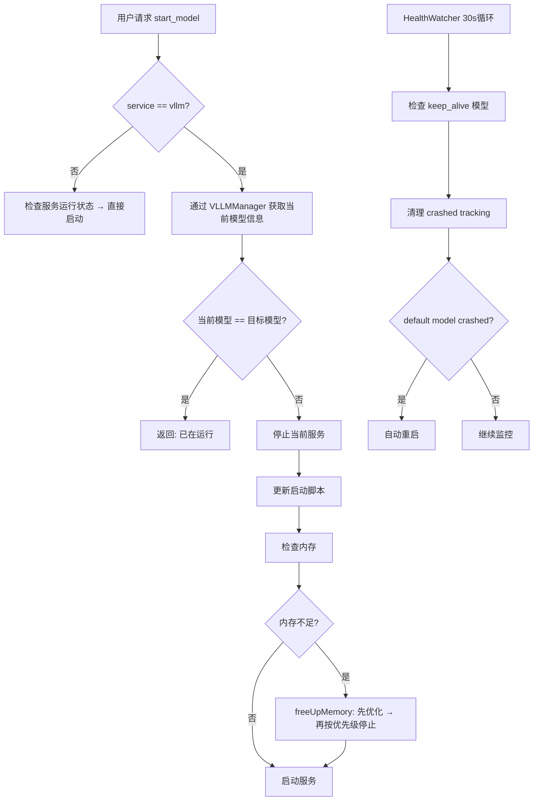

# AIOS-GO-PYTHON-V1 技术方案: Go/Python 服务功能对齐与配置统一

## 1. 背景 & 目标

当前 ai-os 项目中 Python (app-controller) 和 Go (go-vllm-api) 两个后端服务功能不对齐。Python 服务在近期的升级中引入了多项关键改进，但 Go 服务尚未同步。同时，3套配置文件 (root config.yaml, app-controller/config.yaml, go-vllm-api/config.yaml) 存在模型列表不一致的问题。

**目标**: 将 Python 服务的 7 项关键增强功能对齐到 Go 服务，统一配置模型列表，确保两个后端 API 功能完全一致。

## 2. 范围 & 不做

**做**:
- Go scheduler: vLLM 模型切换逻辑对齐（检查当前模型 → 更新脚本 → 重启）
- Go scheduler: freeUpMemory 增强（optimize_memory + 优先级排序）
- Go scheduler: health watcher 对齐（清理 crashed tracking + 自动重启 default model）
- Go GPUMonitor: health_score 计算
- Go GPUMonitor: optimize_memory / force_memory_cleanup 方法
- Go manage handler: GPUSummary 返回 health_score
- 配置统一: root config.yaml 和 go-vllm-api config.yaml 补充缺失的 llama_cpp 模型与 supports_* 字段

**不做**:
- Python 侧无新增改动（当前已领先）
- 前端改动（API 响应格式兼容，无需修改）
- Mock 系统改动（已完善）
- docker-compose 架构调整

## 3. 核心设计思路

### 3.1 Go Scheduler vLLM 切换逻辑对齐

Python 的 `start_model()` 在 vLLM 模型切换时增加了关键逻辑：
1. 检查当前运行的模型是否是目标模型 → 如果是，直接返回成功
2. 如果不是目标模型但服务正在运行 → 先停止服务
3. 更新 vLLM 启动脚本中的模型路径
4. 启动服务

Go 的 `StartModel()` 当前只检查 `IsServiceRunning`，不检查具体加载了哪个模型。需要通过 VLLMManager 增加类似逻辑。

### 3.2 Go freeUpMemory 增强

Python 版本增加了：
1. 先尝试 `optimize_memory()` (GPU 缓存清理) 而不是直接停止模型
2. 模型排序策略: priority + last_used + memory_size，优先停止低优先级、久未使用、大内存模型

Go 版本当前是简单遍历 runningModels 直接停止。

### 3.3 Go HealthWatcherLoop 对齐

Python 版本的 `_health_watcher_loop()` 包含两部分：
1. 检查 keep_alive 模型是否运行，重启已停止的模型
2. 清理 running_models 中实际已停止的跟踪状态，自动重启 default model

Go 版本的 `PreloadWatcherLoop()` 只做了第1部分。

### 3.4 Go health_score & optimize_memory

Python 版本的 `get_health_score()` 基于温度、内存利用率、降频惩罚计算 0-100 分。
Python 版本的 `optimize_memory()` 在显存碎片率过高时执行 vLLM 缓存清理。

## 4. 方案流程图

## 5. 关键状态机

**模型切换状态机**: stopped → checking → script_updated → starting → ready → running
**内存管理状态机**: sufficient → tight(try optimize) → insufficient(stop models) → critical(force cleanup)

## 6. 风险与验证策略

| 风险 | 等级 | 缓解措施 |
|------|------|---------|
| Go vLLM 切换逻辑与 Python 不一致导致模型不正确 | P0 | 复用 VLLMManager.GetCurrentModelInfo() |
| freeUpMemory 优先级排序改变导致错误停止关键模型 | P1 | keep_alive 模型永远不停止 |
| health_score 计算公式偏差 | P2 | 与 Python 公式完全一致 |
| 配置合并遗漏模型 | P1 | 逐字段对比确认 |

## 7. 待确认项

- Go VLLMManager 是否需要新增 GetCurrentModelInfo() 方法？ → 需要，读取启动脚本解析当前模型路径
- Go GPUMonitor 的 optimize_memory 是否需要 vLLM 缓存 flush API？ → 需要，调用 vLLM /cache_admin endpoint
