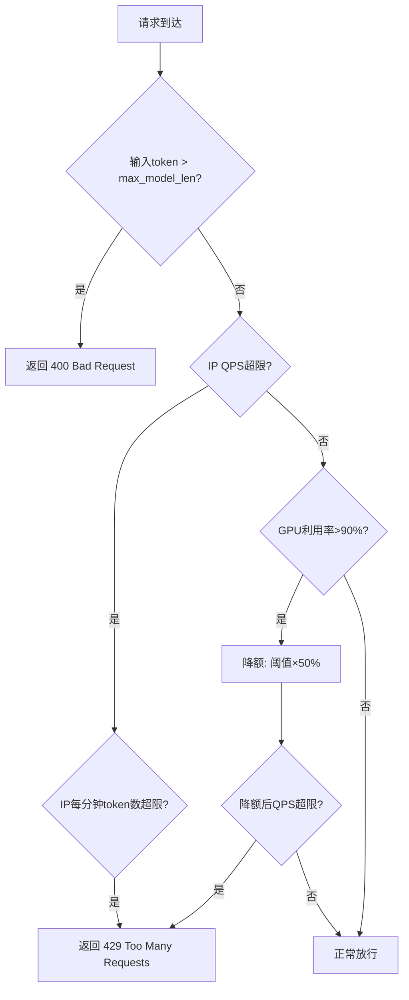
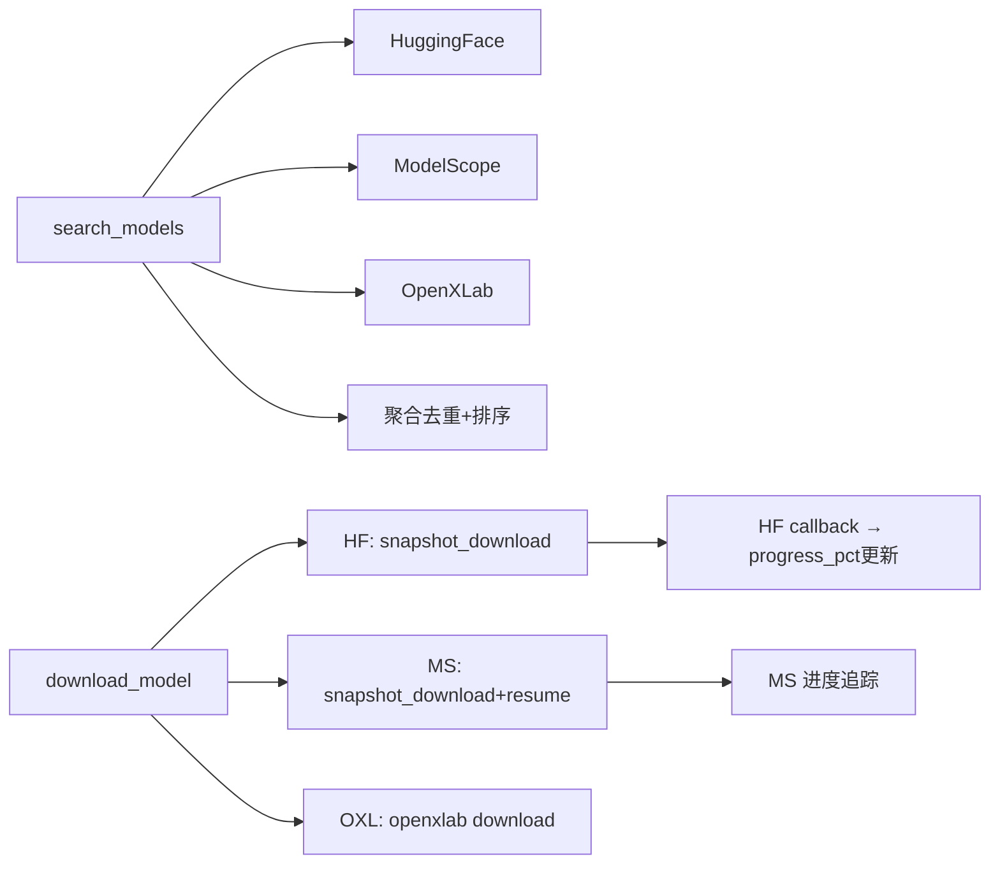
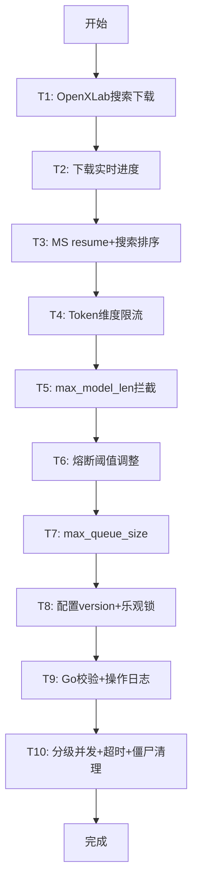

# 技术方案: PRD 全功能升级迭代

> 任务 ID: AIOS-PRD-V2-UPGRADE | 平台: Go + Python Backend

---

## 1. 背景 & 目标

基于 PRD v1.3 全量代码审计，发现 18/22 功能点已完整实现，仅 6 个功能点存在真实缺口需补齐。本方案聚焦于这些真实缺口的高效修复。

---

## 2. 范围 & 不做

**IN SCOPE**:
- F15: OpenXLab 搜索/下载 + 下载实时进度 + MS resume_download
- F16: 搜索排序 + source=all 聚合
- F3: token 维度限流 + max_model_len 前置拦截 + GPU 显存自适应
- F8: CircuitBreaker threshold=10/reset=5s + max_queue_size
- F12: config version + 乐观锁 + Go 校验 + 操作日志
- F4: 分级并发 + 30min 超时 + 僵尸流式清理 + goroutine 监控

**OUT OF SCOPE**: F13/F14/F22 (已实现)、前端新增页面、多仓架构

---

## 3. 核心设计思路

### F3: 限流增强

**关键实现**:
- `rate_limiter.go`: 新增 `TokenLimiter` (Redis key: `ratelimit:token:{ip}`, 窗口60s)
- `chat.go`: 前置 `estimateTokens(payload)` 与 config 中 `max_model_len` 比较
- `ratelimit.go`: GPU `gpuUtilization > 0.90` 时 `effectiveLimit = limit * 0.5`

### F15/F16: OpenXLab + 实时进度

**关键实现**:
- `model_hub.py._search_oxl()`: openxlab API (`https://openxlab.org.cn/models/search`)
- `model_hub.py._download_oxl()`: `openxlab.api.download_model()`
- `download_manager.py`: HF `snapshot_download` 使用 `tqdm` callback 追踪进度 → `task.progress_pct` 中间更新
- MS: `snapshot_download(model_name, resume_download=True, local_dir=...)`

### F12: 配置管理增强

**version + 乐观锁**:
- `config.yaml` 顶层新增 `version: 1` (int)
- `config_watcher.py.save_config()` 自动 `version += 1`
- `PUT /manage/config` 校验请求 version == 当前 version，不匹配返回 409
- Python 配置变更后调用 `httpx.get("http://localhost:35001/manage/config")` 校验一致性

**操作日志**:
- `config_watcher.py` 新增 `_operation_log: List[Dict]` 记录 `{operator, timestamp, before, after, version}`

### F4: 并发控制增强

**分级并发**:
- `config.yaml` 新增 `max_stream_concurrent: 50` (与 max_concurrent: 100 分开)
- `scheduler.go` 新增 `streamSlots` semaphore + `AcquireStreamSlot`/`ReleaseStreamSlot`

**流式超时**:
- `context.WithTimeout(streamCtx, 30*time.Minute)` 替代现有硬编码

**僵尸清理**:
- `zombieChecker` 扩展: 遍历 `streamConnections` map，清理 `lastActivity > 5min` 的连接

---

## 4. 方案流程图 (整体)

---

## 5. 风险与验证策略

| 风险 | 级别 | 缓解措施 |
|------|------|----------|
| OpenXLab API不稳定 | medium | 降级到HF/MS，超时5s返回空结果 |
| HF下载回调进度精度 | medium | tqdm callback 每1%更新，WS推送 |
| token估算偏差(非精确计算) | medium | 保守估算: 字符数/4 → token数 |
| Redis token counter延迟 | low | 窗口60s滑动，精度损失可接受 |
| CircuitBreaker阈值变更影响 | low | threshold从5→10更宽松，实际降低误熔断概率 |
| config version冲突频繁 | low | 前端获取最新version后再提交 |

---

## 6. 待确认项

无。所有缺口已有明确实现方案。
