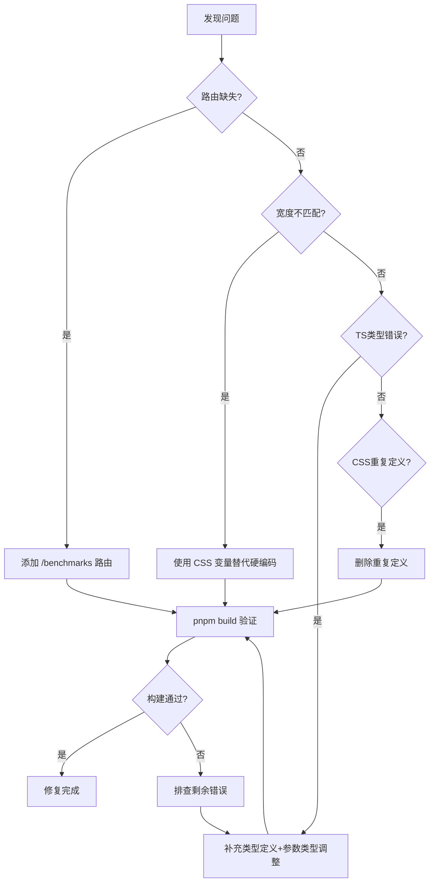

# FRONTEND-FIX-001 技术方案：前端界面修复

## 背景 & 目标

ai-os 前端界面存在4个关键bug，导致页面布局错位、路由不可达、构建失败。需要修复以确保界面正常显示和功能正常。

## 范围 & 不做

**做**：
- 修复 benchmarks 路由缺失
- 修复 sidebar/main 宽度不匹配
- 修复 TS 类型错误
- 修复 CSS 重复定义

**不做**：新增功能、后端修改、UI 设计变更

## 核心设计思路

### Fix 1: 路由缺失
在 `router/index.ts` 中新增 `/benchmarks` 路由，指向 `ModelBenchmarks.vue`。

### Fix 2: 宽度不匹配
`App.vue` 的 `mainMargin` 从硬编码 `220px/64px` 改为引用 CSS 变量 `var(--sidebar-width)/var(--sidebar-collapsed-width)`，与 sidebar 实际宽度 `240px/68px` 对齐。

### Fix 3: TS 类型错误
- `SystemStatus` 类型添加可选 `queue?: QueueStatus` 字段
- `useSystemData`/`useTokenHistory` 的 `initialCount` 参数改用 `MaybeRefOrGetter<number>`
- Dashboard 中 `queueStatus` 添加类型断言

### Fix 4: CSS 重复定义
删除 `style.css` 中第二处 `--shadow-glow` 定义。

## 修复流程

## 验收策略

| AC | 验证方式 | 预期结果 |
|----|---------|---------|
| AC-1 | 点击侧边栏"模型评测" | 跳转到 /benchmarks，ModelBenchmarks.vue 渲染 |
| AC-2 | sidebar 展开 | main marginLeft=240px，无重叠 |
| AC-3 | sidebar 折叠 | main marginLeft=68px，无重叠 |
| AC-4 | `pnpm build` | 0 个 TS 错误，构建通过 |

## 风险与验证

- **低风险**：CSS 变量方案浏览器兼容性好，Vue 3 + Vite 项目无兼容问题
- **回滚策略**：git revert 逐文件回滚
