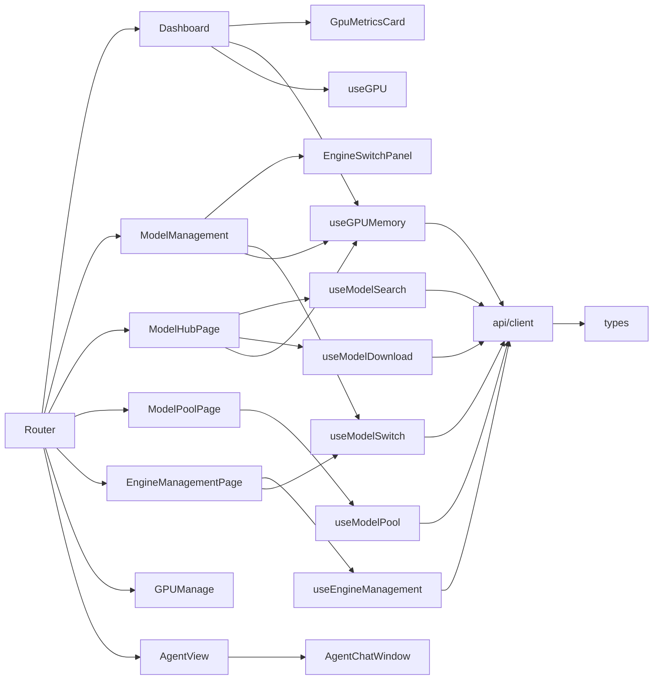

# 影响分析报告 — frontend-redesign

> 分析模式: tech-solution.yaml | 平台: Web (Vue3)

## 变更概览

- 直接变更文件: 18 个
- 上游影响(调用方): 高爆炸半径文件 types/index.ts(34)/api/client.ts(25)
- 下游影响(依赖项): composables→API→types 链路
- 测试覆盖缺口: 11/18 个变更文件无测试
- **风险等级: 🟡 MEDIUM**

## 调用链路图

## 关键风险发现

1. **ZERO测试覆盖** — 11/18个变更文件无测试文件
2. **ModelManagement.vue 3904行** — 新增功能可能超4000行
3. **EngineSwitchPanel.vue未被导入** — 需新建依赖关系
4. **useGPUMemory vs useEngineManagement API重叠** — switchEngine/getEngineStatus两处调用

## 回归测试建议

- `cd frontend && pnpm test`
- `cd frontend && pnpm build`
- 手动验证: Dashboard GPU告警/引擎切换Phase2.5/搜索徽章/一键加载
