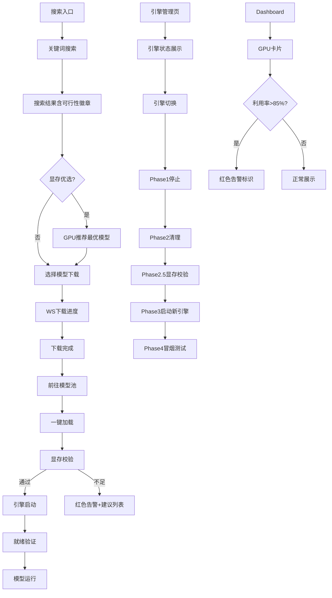

# 技术方案 — Vue3 前端重新设计 + aiclient 插件功能升级

> taskId: frontend-redesign | source: docs/agent/prd.md 功能点 14-22

---

## 1. 背景 & 目标

将分散的模型搜索/下载/引擎/显存/模型池功能整合到统一前端管控面板，实现 **搜索→下载→校验→加载→推理** 全流程可视化。

**现状**: 8个页面、12个composables、15+API方法已存在，本次以 **UI重设计+功能完善+TS类型修复** 为主。

---

## 2. 范围 & 不做

**IN**: Vue3前端页面/composable/API client/路由/类型/aiclient插件前端UI
**OUT**: Go/Python后端核心/Docker/部署配置

---

## 3. 核心设计思路

### 3.1 全流程可视化链路

```
搜索(ModelHub) → 下载(WS进度) → 入池(ModelPool) → 显存校验 → 引擎启动 → 就绪验证 → 推理
```

关键衔接:
- ModelHub 搜索结果含 feasibility 徽章，下载完成后"前往模型池"按钮
- ModelPool 一键加载: `checkModelMemory → loadFromPool → pollStatus(ready)`
- Dashboard GPU告警: utilization>85% → 红色标识

### 3.2 多引擎管理可视化

引擎切换4阶段含Phase2.5:
```
Phase1: 停止旧引擎 → Phase2: 清理进程 → Phase2.5: 显存校验 → Phase3: 启动新引擎 → Phase4: 冒烟测试
```

引擎配置编辑: `getEngineConfig → updateEngineConfig`(API已存在)

---

## 4. 方案流程图



---

## 5. 关键状态机

### 模型加载状态机

```
idle → checking_memory → (feasible) → loading → running
                    → (not_feasible) → rejected → alert
```

### 下载状态机

```
pending → downloading → completed → pool_register
                     → failed → retry
                     → cancelled
```

### 引擎切换状态机

```
idle → phase1_stop → phase2_cleanup → phase2.5_memory_check → phase3_start → phase4_test → completed
                                                                  → (failed) → rollback
```

---

## 6. 风险与验证策略

| 风险 | 级别 | 应对 |
|------|------|------|
| ModelManagement 3791行膨胀 | P1 | EngineSwitchPanel独立子组件 |
| useGPUMemory Ref类型 | P1 | 解构为顶层ref |
| WS断连 | P2 | 降级3s轮询+状态灯 |
| 多下载并行 | P2 | 后续版本队列管理 |

**验证**: `pnpm test` + `pnpm build`，6条AC逐条检查

---

## 7. 待确认项

无

---

## 8. YAML 机读区块

见 `tech-solution.yaml`
