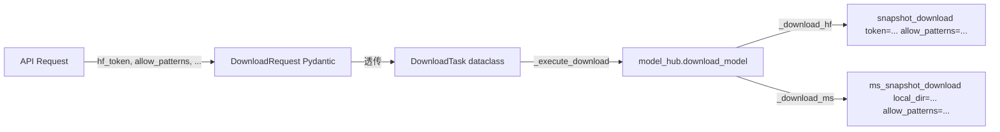

# 模型下载功能完善技术方案

## 1. 背景 & 目标

当前模型下载功能已基本实现，但存在关键缺口：
- **HF_TOKEN 不支持**：`snapshot_download` 未传 `token`，无法下载私有/门控模型
- **下载参数不全**：HF SDK 的 `allow_patterns/ignore_patterns/max_workers/force_download` 均未暴露
- **ModelScope 参数不全**：使用 `cache_dir` 而非 `local_dir`，不支持 `allow_patterns/ignore_patterns`
- **搜索未认证**：`HfApi` 搜索不传 token，无法搜索私有模型
- **配置无类型安全**：下载配置为 raw dict，缺少 Pydantic 模型
- **进度回调空置**：`_progress_callbacks` 基础设施存在但从未在下载过程中触发

目标：完善模型下载功能，支持 HF_TOKEN、自定义下载路径、全参数 API，确保模型能正常下载。

## 2. 核心设计思路

### 2.1 HF_TOKEN 传递链路

```
优先级: API请求参数 > 环境变量 HF_TOKEN > config.yaml engines.hub.hf_token

传递路径:
  API Request (hf_token) 
    → DownloadRequest.hf_token 
    → DownloadTask.hf_token 
    → download_manager._execute_download() 
    → model_hub.download_model(hf_token=...) 
    → snapshot_download(token=hf_token)
```

### 2.2 参数传递架构



### 2.3 DownloadConfig Pydantic 模型

```python
class DownloadConfig(BaseModel):
    hf_token: Optional[str] = None
    ms_token: Optional[str] = None
    hf_endpoint: str = "https://hf-mirror.com"
    save_root: str = "/mnt/pve_models"
    max_concurrent: int = 3
    max_workers: int = 8
    disk_warning_pct: float = 0.85
    disk_abort_pct: float = 0.95
    default_allow_patterns: Optional[List[str]] = None
    default_ignore_patterns: Optional[List[str]] = None
```

### 2.4 下载进度回调

使用 `huggingface_hub.snapshot_download` 的 `tqdm_class` 参数，自定义进度类捕获实时进度：

```python
class TqdmProgressCallback:
    def __init__(self, task: DownloadTask, manager: DownloadTaskManager):
        self.task = task
        self.manager = manager
    
    def update(self, n=1):
        # 从 tqdm bar 获取进度百分比和速度
        self.task.progress_pct = ...
        self.task.speed_mbps = ...
        self.manager._fire_progress(self.task)
```

## 3. 关键变更

| 文件 | 变更类型 | 说明 |
|------|---------|------|
| `core/config.py` | modify | 新增 DownloadConfig Pydantic 模型 |
| `core/model_hub.py` | modify | download_model 全参数支持 + HF search 带 token |
| `core/download_manager.py` | modify | DownloadTask 新字段 + 透传 + TqdmProgressCallback |
| `routes/model_hub.py` | modify | DownloadRequest 新字段 |
| `routes/manage.py` | modify | start_download 解析新参数 |
| `config.yaml` | modify | engines.hub 新增 hf_token/ms_token/max_workers |
| `.env.example` | modify | 新增 HF_TOKEN/HF_ENDPOINT |
| `core/deps.py` | modify | HF_TOKEN 注入 |
| `tests/test_model_hub.py` | modify | 新增参数测试 |
| `tests/test_download_manager.py` | modify | 新增参数 + 进度测试 |
| `frontend/src/api/client.ts` | modify | startDownload 新参数 |
| `frontend/src/types/index.ts` | modify | DownloadTask 新字段 |

## 4. 验证策略

1. 单元测试：新增 DownloadConfig、model_hub 参数透传、download_manager hf_token 测试
2. 集成测试：startDownload API 带 hf_token/allow_patterns
3. 手动验证：配置 HF_TOKEN 环境变量后下载门控模型（如 Llama-2-7b-chat-hf）

## 5. 风险与缓解

| 风险 | 等级 | 缓解 |
|------|------|------|
| HF_TOKEN 泄露 | P1 | API 日志脱敏，to_dict 不输出 token |
| ModelScope local_dir 兼容性 | P2 | 版本检查降级到 cache_dir |
